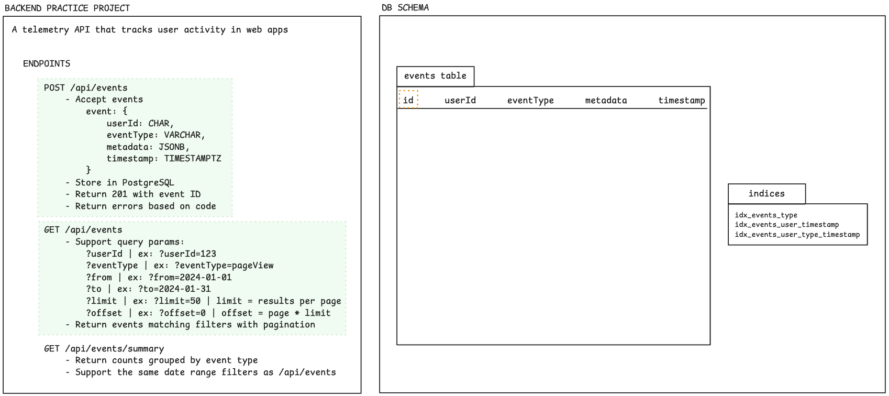
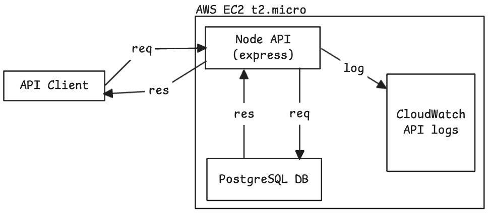
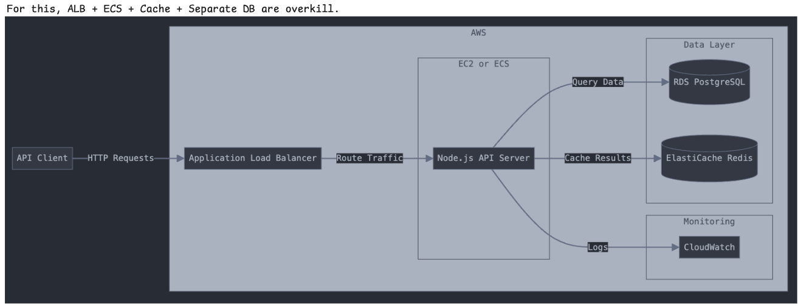

# deno-telemetry-api

Overview

Simplified system design:

- Uses a t2.micro because it's free on AWS
- Ignores load balancer & caching
- Focuses solely on implementing the API and DB
  

Scaled a bit:

- Would need some back-of-the-envelope math to estimate instance type needed (not t2.micro)
- Adds a load balancer to avoid overwhelming any one API server in our ECS cluster
- Adds a cache for faster read performance  
  
